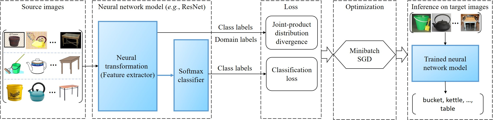

# Joint-Product-Distribution-Alignment

This repository provides the Pytorch code for the work "Domain Generalization by Joint-Product Distribution Alignment" published in Pattern Recognition, 2022. In this work, we study the non-identically distributed supervised learning problem, where the training data are sampled from multiple different (probability）distributions, while the test data are governed by another different yet related distribution. We design a Joint-Product Distribution Alignment (JPDA) approach that aligns a joint distribution and a product distribution to tackle the distribution difference (see the illustration below), with (1) the loss function being the Relative Chi-Square (RCS) divergence, (2) the hypothesis space being the neural network transformation, and (3) the learning algorithm being the minibatch Stochastic Gradient Descent (minibatch SGD). 

For more details of this domain generalization approach,  please refer to the following PR work: 

@article{Chen2022DomainGeneralization,  
  author={Sentao Chen and Lei Wang and Zijie Hong and Xiaowei Yang},  
  journal={Pattern Recognition},   
  title={Domain Generalization by Joint-Product Distribution Alignment},   
  year={2022},   
  pages={109086},  
  doi={https://doi.org/10.1016/j.patcog.2022.109086}  
  }

